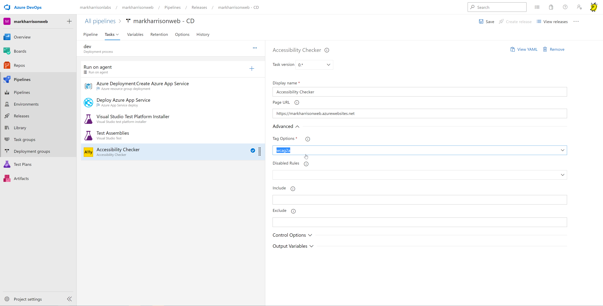
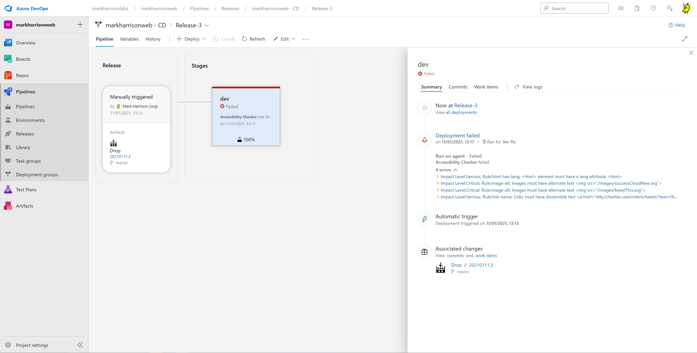
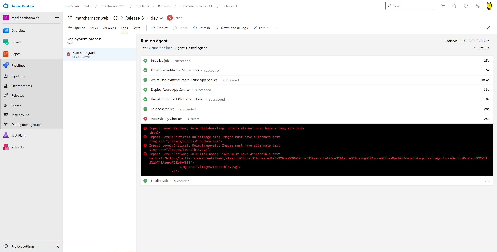

# Azure DevOps

Hands-on Lab Script - Part 4

## Accessibility  

Recent regulations mean UK public sector organisations have a legal duty to make sure websites and
apps meet accessibility requirements. Commercial organisations should also adhere to these
requirements because it’s the right thing to do.

Microsoft is committed to revolutionizing access to technology for people living with disabilities—
impacting employment and quality of life for more than a billion people in the world.

## Accessibility Testing

As part of the release pipeline - add the Accessibility Checker - this can be obtained from the Marketplace

[Accessibility Checker](https://marketplace.visualstudio.com/items?itemName=DrewLewis.Accessibility)

The task configuration allows selection of the required standards to be validated against

Now add a User Story to get the detected issues fixed !

## More info

- <https://www.microsoft.com/accessibility>
- <https://accessibilityinsights.io/>